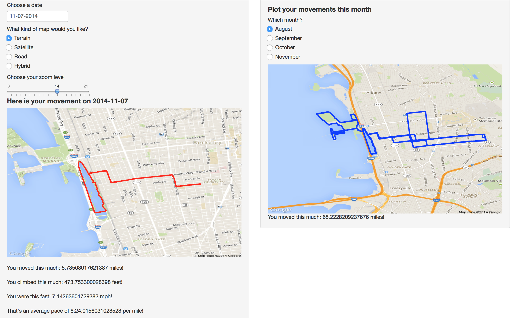

```{r setup, include=FALSE}
options(htmltools.dir.version = FALSE, width = 93)
knitr::opts_chunk$set(fig.dim = c(4.8, 4.5), fig.retina = 2, out.width = "100%", message = FALSE, warning = FALSE, cache = TRUE)
knitr::opts_hooks$set(fig.callout = function(options) {
  if (options$fig.callout) {
    options$echo <- FALSE
    options$out.height <- "99%"
    options$fig.width <- 16
    options$fig.height <- 8
  }
  options
})
library(tidyverse)
reveal <- function(name, num) {
  content <- knitr:::knit_code$get(name)
  last_line <- which(str_detect(content, "\\+"))[num]
  if (is.na(last_line)) last_line <- length(content)
  if (num == 1) {
    first_line <- 1
    } else {
    first_line <- which(str_detect(content, "\\+"))[num - 1] + 1
    }
  content[last_line] <- str_remove(content[last_line], "\\+")
  new_lines <- paste0(content[first_line:last_line], " #<<")
  orig_lines <- if (num == 1) 0 else 1:(first_line-1)
  c(content[orig_lines], new_lines)
}
nlsy <- read_csv(here::here("data", "nlsy.csv"))
nlsy %>%
  mutate_all(~ifelse(.<= -998 | between(., -6, -1), NA, .)) %>%
  na.omit %>%
  write_csv(here::here("data", "nlsy_cc.csv"))
rm(nlsy)

```
```{css, echo=FALSE}
/* custom.css */
.title-slide {
  background-image: url("img/camp.svg");
  background-size: cover;
}

.left-code {
  #color: #777;
  width: 43%;
  height: 92%;
  float: left;
  #font-size: 0.8em;
  position: absolute;
}
.right-plot {
  width: 50%;
  float: right;
  padding-left: 5%;
}
.left-col {
  width: 60%;
  float: left;
  position: absolute;
}
.right-col {
  width: 30%;
  float: right;
  padding-left: 5%;
}
.plot-callout {
  height: 225px;
  width: 450px;
  bottom: 5%;
  right: 5%;
  position: absolute;
  padding: 0px;
  z-index: 100;
}
.plot-callout img {
  width: 100%;
  border: 4px solid #23373B;
}

h4 {
  color: #F97B64;
  font-size: 22px;
  text-align: center;
}

h1, h2, h3, h4 {
  margin-top:3;
}

.inverse h1, .inverse h2, .inverse h3 {
  color: #1F4257;
}
.remark-slide thead, .remark-slide tr:nth-child(2n) {
  background-color: white;
}
.title-slide, .title-slide h1, .title-slide h2, .title-slide h3 {
color: #1F4257;
}
.title-slide {
  background-image: url("img/paper.jpg");
  background-size: cover;
}

```
```{r xaringan-themer, include=FALSE}
library(xaringanthemer)
duo_accent(
  primary_color = "#1F4257",
  secondary_color = "#F97B64",
  header_font_google = google_font("Lexend Deca"),
  text_font_google = google_font("Noto Sans")
)
```

# About this class

- Non-credit
<br>

- 5 sessions
<br>

- "Challenges" but no homework

--
<br>

### Work hard with each other during class

Try to figure it out on your own before you ask for help

--

### Practice by yourself in between classes

You are not going to break anything!

--

.center[
#### Anyone can learn to use R, it's just a matter of sitting down and doing it. Now's your chance!

]

---
# About me

.pull-left[
- 4th-year PhD candidate in Epidemiology
<br>

- Started using R during my masters (so 5 years of experience); learned mostly by doing
<br>

- Problem sets, manuscripts, slides, website all in R (www.louisahsmith.com)
<br>

- Almost 100 R projects on my computer, including over 1000 R scripts


]
.pull-right[

]

--
.center[
#### I have to Google things literally every time I use R!
]

---
.pull-left[

]
.pull-right[.middle[
<br>

<br>


### An IDE for R

An *integrated development environment* is software that makes coding easier

- see objects you've imported and created
- autocomplete
- syntax highlighting
- run part or all of your code
]]

---
class:middle inverse center
background-image: url(img/rstudio.png)
background-size: contain

---
count: false
class:middle inverse center
background-image: url(img/rstudio-markup.png)
background-size: contain

--
<br>
# RStudio demonstration

---
# R uses `<-` for assignment

Create an object `vals` that contains and sequence of numbers:

```{r}
# create values
vals <- c(1, 645, 329)
```

Put your cursor at the end of the line and hit ctrl/cmd + enter.

Now `vals` holds those values.

We can see them again by running just the name (put your cursor after the name and press ctrl/cmd + enter again).

```{r}
vals
```
### No assignment arrow means that the object will be printed to the console.

---
# Types of data (*classes*)

We could also create a character *vector*:

```{r}
chars <- c("dog", "cat", "rhino")
chars
```

Or a *logical* vetor:

```{r}
logs <- c(TRUE, FALSE, FALSE)
logs
```

### We'll see more options as we go along!

---

# Types of objects

We created *vectors* with the `c()` function (`c` stands for concatenate)

We could also create a *matrix* of values with the `matrix()` function:
```{r}
# turn the vector of numbers into a 2-row matrix
mat <- matrix(c(234, 7456, 12, 654, 183, 753), nrow = 2)
mat
```

The numbers in square brackets are *indices*, which we can use to pull out values:

```{r}
# extract second row
mat[2, ]
```

---
class: inverse
# Exercises 1
.center[
<iframe src="https://giphy.com/embed/l0HlQ7mVw7pPtItEc" width="265" height="238" frameBorder="0" class="giphy-embed" allowFullScreen></iframe><p><a href="https://giphy.com/gifs/gifitup-halloween-hypnosis-l0HlQ7mVw7pPtItEc"></a></p>
]
1. Extract `645` from `vals` using square brackets
2. Extract `"rhino"` from `chars` using square brackets
3. You saw how to extract the second row of `mat`. Figure out how to extract the second column.
4. Extract `183` from `mat` using square brackets
5. Figure out how to get the following errors: 

```{r, echo = FALSE}
print("incorrect number of dimensions")
print("subscript out of bounds")
```

---
# Dataframes

We usually do analysis in R with dataframes (or some variant).

Dataframes are basically like spreadsheets: columns are variables, and rows are observations.
```{r}
gss_cat
```

---
background-image: url(https://ih1.redbubble.net/image.543363717.2207/pp,840x830-pad,1000x1000,f8f8f8.jpg)
background-size:contain

# *tibble*???

---

# Packages in R

Although R comes with a number of functions (and datasets! try running `data()`), you can also add on lots of **packages**.

Many packages can be found on [CRAN](https://cran.r-project.org), which is what R goes to automatically when you run `install.packages("packagename")`.

Other packages live only on GitHub, or in other repositories. To download these, you will have to use something like `remotes::install_github("developer/package")` or similar.

You only need to install a package once (until it needs to be updated, or you update R). But every time you want to use a package, you need to include `library(packagename)` at the top of your script, and run that before you run any functions.


---
# tidyverse
.left-column[

]
.right-column[
The tidyverse is a collection of packages for R that are designed to make working with data easy and intuitive.

You might hear it contrasted with "base R" or the package `data.table`. You can (and should!) learn as many coding techniques and strategies as possible, then choose the best option (in terms of speed, readability, etc.) for you.

I find tidyverse the quickest and most intuitive way to get up and running with R.

```{r, eval = FALSE}
install.packages("tidyverse")
library(tidyverse)
# installs and loads ggplot2, dplyr, tidyr, readr,
# purrr, tibble, stringr, forcats
```
]

---
## and tibbles are the quickest and most intuitive way to make and read a dataset
.pull-left[
```{r}
dat1 <- tibble(
  age = c(24, 76, 38),
  height_in = c(70, 64, 68),
  height_cm = height_in * 2.54
)
dat1
```
]
.pull-right[
```{r}
dat2 <- tribble(
  ~n, ~food, ~animal,
  39, "banana", "monkey",
  21, "milk", "cat",
  18, "bone", "dog"
)
dat2
```
]

---
## tibbles are basically just pretty dataframes
.pull-left[
```{r, comment = NA}
as_tibble(gss_cat)[, 1:5]
```
]
.pull-right[
```{r, comment = NA, eval = FALSE}
as.data.frame(gss_cat)[, 1:5]
```
```{r, comment = NA, echo = FALSE}
as.data.frame(gss_cat)[1:20, 1:5]
```
]

---
class: middle center


We'll use some data from the [National Longitudinal Survey of Youth 1979](https://www.nlsinfo.org/content/cohorts/nlsy79), a cohort of American young adults aged 14-22 at enrollment in 1979. They continue to be followed to this day, and there is a wealth of publicly available data [online](https://www.nlsinfo.org/investigator/pages/login.jsp). I've downloaded the answers to a survey question about whether respondents wear glasses, a scale about their eyesight with glasses, whether they are black or white/hispanic, their sex, their family's income in 1979, and their age at the birth of their first child.
---
# Read in data
```{r, eval = FALSE}
nlsy <- read_csv("nlsy_cc.csv")
nlsy
```
```{r, echo = FALSE, message = FALSE}
nlsy <- read_csv(here::here("data", "nlsy_cc.csv"))
print(nlsy, n = 2)
```
Ugh...
```{r}
colnames(nlsy)
colnames(nlsy) <- c("glasses", "eyesight", "sleep_wkdy", "sleep_wknd",
                    "id", "nsibs", "samp", "race_eth", "sex", "region", 
                    "income", "res_1980", "res_2002", "age_bir")
```

---
# Explore your data
```{r}
glimpse(nlsy)
```

---
count:false
# Explore your data
```{r}
summary(nlsy)
```

---
count:false
# Explore your data
```{r}
summary(nlsy$glasses)
mean(nlsy$age_bir)
?cor
```

---
# Get help!

.pull-left[
- `help(cor)`
- https://www.rdocumentation.org
- https://rdrr.io
- https://www.r-project.org/help.html
- SO. MUCH. MORE.
]
.pull-right[

]

---
class: inverse
# Exercises 2
.center[
<iframe src="https://giphy.com/embed/TvVck7lO4LDJS" width="320" height="240" frameBorder="0" class="giphy-embed" allowFullScreen></iframe><p><a href="https://giphy.com/gifs/TvVck7lO4LDJS"></a></p>
]

1. How many people are in the NLSY? How many variables are in this dataset? What are two ways you can answer these questions?
2. Can you find an R function(s) we haven't discussed that answers question 2? (Hint: Google)
3. What's the Spearman correlation between hours of sleep on weekends and weekdays in this data?
4. I've also provided you with the same dataset as an Excel document, but it's not on the first sheet, and there's an annoying header. Load the `readxl` package (you already installed with with `tidyverse`, but it doesn't load automatically). Figure out how to read in the data. This may help: https://readxl.tidyverse.org.

---
# #goals
.pull-left[
```{r goals-plot-1, echo = FALSE, warning = FALSE, out.width="500px", out.height = "500px", fig.align = "center"}
ggplot(data = nlsy) +
  geom_bar(aes(x = eyesight, 
               fill = factor(eyesight))) +
  facet_grid(
    cols = vars(glasses),
    labeller = labeller(glasses = c(
      "0" = "Doesn't wear glasses",
      "1" = "Wears glasses/contacts"))) +
  scale_fill_brewer(palette = "Spectral", 
                    direction = -1) +
  scale_x_continuous(
    labels = c("Excellent", "Very Good", 
               "Good", "Fair", "Poor"),
    breaks = c(1, 2, 3, 4, 5)) +
  theme_minimal() +
  theme(legend.position = "none",
        axis.text.x = element_text(angle = 45, 
                                   vjust = 1, 
                                   hjust = 1)) +
  labs(title = "Eyesight quality in NLSY",
       x = "Eyesight quality",
       y = NULL) +
  coord_cartesian(expand = FALSE)
```
]
.pull-right[

```{r goals-plot-2, echo = FALSE, warning = FALSE, out.width="500px", out.height = "500px", fig.align = "center"}
ggplot(data = nlsy,
  aes(income, age_bir, col = factor(sex))
) +
  geom_point(alpha = 0.1) +
  scale_color_brewer(palette = "Set1",
    name = "Sex",
    labels = c("Male", "Female")) +
  scale_x_log10(labels = scales::dollar) +
  geom_smooth(aes(
    group = factor(sex)), 
    method = "lm") +
  facet_grid(rows = vars(race_eth),
    labeller = labeller(race_eth = c(
      "1" = "Hispanic",
      "2" = "Black",
      "3" = "Non-Black, Non-Hispanic"))) +
  theme_minimal() +
  theme(legend.position = "top") +
  labs(title = "Relationship between income and age at first birth",
    subtitle = "by sex and race",
    x = "Income",
    y = "Age at first birth")
```
]

---
# #goals

```{r, echo = FALSE}
run_analysis <- function(group) {
  dat <- nlsy %>%
    mutate(
      eyes = factor(eyesight, labels = c("Excellent", "Very Good", "Good", "Fair", "Poor")),
      sample = case_when(
        samp %in% 1:8 ~ "main",
        samp %in% 9:14 ~ "supplementary",
        samp %in% 15:20 ~ "military"
      )
    ) %>%
    filter(sample == group)

  fit <- glm(glasses ~ eyes, family = binomial, data = dat)
  ors <- exp(coef(fit)[-1])
  cis <- exp(confint(fit)[-1, ])
  pvals <- summary(fit)$coefficients[-1, 4]
  coefs <- levels(dat$eyes)[-1]

  res <- tibble(
    coef = coefs,
    OR = ors,
    lCI = cis[, 1],
    uCI = cis[, 2],
    p = pvals
  ) %>%
    mutate(
      coef = fct_relevel(coef, c("Very Good", "Good", "Fair", "Poor")),
      p_round = scales::pvalue(p),
      OR_round = prettyNum(OR, digits = 2, nsmall = 2),
      lCI_round = prettyNum(lCI, digits = 2, nsmall = 2),
      uCI_round = prettyNum(uCI, digits = 2, nsmall = 2),
      CI = str_glue("{OR_round} ({lCI_round}, {uCI_round})")
    )

  ref <- tibble(coef = "Excellent", CI = "1 (ref)", p_round = NA)

  tab <- res %>%
    select(coef, CI, p_round)
  tab <- bind_rows(ref, tab)
  colnames(tab) <- c("Eyesight", "OR (95% CI)", "P-value")

  write_csv(tab, path = str_glue("results/table_{group}.csv"))

  p <- ggplot(res) +
    geom_point(aes(x = coef, y = OR)) +
    geom_errorbar(aes(x = coef, ymin = lCI, ymax = uCI)) +
    geom_hline(yintercept = 1, linetype = "dashed") +
    scale_y_log10(
      breaks = 0:100,
      limits = c(min(c(1, res$lCI), na.rm = TRUE), min(c(10, max(res$uCI, na.rm = TRUE))))
    ) +
    labs(
      title = "How is the quality of eyesight \nrelated to wearing glasses?",
      subtitle = str_glue("{group} group"),
      x = "Eyesight quality"
    ) +
    theme_minimal()

  ggsave(p, filename = str_glue("results/figure_{group}.pdf"))
}
```
```{r, message = FALSE, warning = FALSE, eval = FALSE}

run_analysis(group = "main")
run_analysis(group = "supplementary")
run_analysis(group = "military")
```
### Ta da!
.center[

]

---
class: middle
# #goals

.pull-left[
```{r, echo = FALSE, warning = FALSE, message = FALSE}
group <- "main"
dat <- nlsy %>%
  mutate(
    eyes = factor(eyesight, labels = c("Excellent", "Very Good", "Good", "Fair", "Poor")),
    sample = case_when(
      samp %in% 1:8 ~ "main",
      samp %in% 9:14 ~ "supplementary",
      samp %in% 15:20 ~ "military"
    )
  ) %>%
  filter(sample == group)

fit <- glm(glasses ~ eyes, family = binomial, data = dat)
ors <- exp(coef(fit)[-1])
cis <- exp(confint(fit)[-1, ])
pvals <- summary(fit)$coefficients[-1, 4]
coefs <- levels(dat$eyes)[-1]

res <- tibble(
  coef = coefs,
  OR = ors,
  lCI = cis[, 1],
  uCI = cis[, 2],
  p = pvals
) %>%
  mutate(
    coef = fct_relevel(coef, c("Very Good", "Good", "Fair", "Poor")),
    p_round = scales::pvalue(p),
    OR_round = prettyNum(OR, digits = 2, nsmall = 2),
    lCI_round = prettyNum(lCI, digits = 2, nsmall = 2),
    uCI_round = prettyNum(uCI, digits = 2, nsmall = 2),
    CI = str_glue("{OR_round} ({lCI_round}, {uCI_round})")
  )

ref <- tibble(coef = "Excellent", CI = "1 (ref)", p_round = NA)

tab <- res %>%
  select(coef, CI, p_round)
tab <- bind_rows(ref, tab)
colnames(tab) <- c("Eyesight", "OR (95% CI)", "P-value")

ggplot(res) +
  geom_point(aes(x = coef, y = OR)) +
  geom_errorbar(aes(x = coef, ymin = lCI, ymax = uCI)) +
  geom_hline(yintercept = 1, linetype = "dashed") +
  scale_y_log10(
    breaks = 0:100,
    limits = c(min(c(1, res$lCI), na.rm = TRUE), min(c(10, max(res$uCI, na.rm = TRUE))))
  ) +
  labs(
    title = "How is the quality of eyesight \nrelated to wearing glasses?",
    subtitle = str_glue("{group} group"),
    x = "Eyesight quality"
  ) +
  theme_minimal()
```
]
.pull-right[.middle[
```{r, echo = FALSE}
knitr::kable(tab, format = "html")
```
]]

---
# Basic structure of a ggplot

```
ggplot(data = {data}) +
      <geom>(aes(x = {xvar}, y = {yvar}, <characteristic> = {othvar}, ...),
             <characteristic> = "value", ...) +
      ...
```
- `{data}`: must be a dataframe (or tibble!)
- `{xvar}` and `{yvar}` are the column names (unquoted) of the variables on the x- and y-axes
- `{othvar}` is some other unquoted variable name that defines a grouping or other characteristic you want to map to an aesthetic


- `<geom>`: the geometric feature you want to use; e.g., point (scatterplot), line, histogram, bar, etc.
- `<characteristic>`: you can map `{othvar}` or a fixed `"value"` to any of a number of aesthetic features of the figure; e.g., color, shape, size, linetype, etc.


- `"value"`: a fixed value that defines some characteristic of the figure; e.g., "red", 10, "dashed"


- ... : there are numerous other options to discover!

---
class:middle, center
## ggplot builds figures by adding on pieces via a particular "*g*rammar of *g*raphics"


---
count: false
.left-code[
```{r goals-plot-1a, fig.show="hide", code=reveal("goals-plot-1", 1)}
```
]
.right-plot[
`)
]

---
count: false

.left-code[
```{r goals-plot-1b, fig.show="hide", code=reveal("goals-plot-1", 2)}
```
]
.right-plot[
`)
]

---
count: false

.left-code[
```{r goals-plot-1c, fig.show="hide", code=reveal("goals-plot-1", 3)}
```
]
.right-plot[
`)
]

---
count: false

.left-code[
```{r goals-plot-1d, fig.show="hide", code=reveal("goals-plot-1", 4)}
```
]
.right-plot[
`)
]

---
count: false

.left-code[
```{r goals-plot-1e, fig.show="hide", code=reveal("goals-plot-1", 5)}
```
]
.right-plot[
`)
]

---
count: false

.left-code[
```{r goals-plot-1f, fig.show="hide", code=reveal("goals-plot-1", 6)}
```
]
.right-plot[
`)
]

---
count: false

.left-code[
```{r goals-plot-1g, fig.show="hide", code=reveal("goals-plot-1", 7)}
```
]
.right-plot[
`)
]

---
count: false

.left-code[
```{r goals-plot-1h, fig.show="hide", code=reveal("goals-plot-1", 8)}
```
]
.right-plot[
`)
]

---
count: false

.left-code[
```{r goals-plot-1i, fig.show="hide", code=reveal("goals-plot-1", 9)}
```
]
.right-plot[
`)
]

---
count: false
.left-code[
```{r goals-plot-2a, fig.show="hide", code=reveal("goals-plot-2", 1)}
```
]
.right-plot[
`)
]

---
count: false

.left-code[
```{r goals-plot-2b, fig.show="hide", code=reveal("goals-plot-2", 2)}
```
]
.right-plot[
`)
]

---
count: false

.left-code[
```{r goals-plot-2c, fig.show="hide", code=reveal("goals-plot-2", 3)}
```
]
.right-plot[
`)
]

---
count: false

.left-code[
```{r goals-plot-2d, fig.show="hide", code=reveal("goals-plot-2", 4)}
```
]
.right-plot[
`)
]

---
count: false

.left-code[
```{r goals-plot-2e, fig.show="hide", code=reveal("goals-plot-2", 5)}
```
]
.right-plot[
`)
]

---
count: false

.left-code[
```{r goals-plot-2f, fig.show="hide", code=reveal("goals-plot-2", 6)}
```
]
.right-plot[
`)
]

---
count: false

.left-code[
```{r goals-plot-2g, fig.show="hide", code=reveal("goals-plot-2", 7)}
```
]
.right-plot[
`)
]

---
count: false

.left-code[
```{r goals-plot-2h, fig.show="hide", code=reveal("goals-plot-2", 8)}
```
]
.right-plot[
`)
]

---

# Basic example

```
ggplot(data = {data}) +
      <geom>(aes(x = {xvar}, y = {yvar}, <characteristic> = {othvar}, ...),
             <characteristic> = "value", ...) +
      ...
```

---
count:false
# Basic example

```
ggplot(data = `nlsy`) +
      <geom>(aes(x = {xvar}, y = {yvar}, <characteristic> = {othvar}, ...),
             <characteristic> = "value", ...) +
      ...
```
### The `data = ` argument must be a dataframe (or tibble)

---
count:false
# Basic example

```
ggplot(data = nlsy) +
      `geom_point`(aes(x = {xvar}, y = {yvar}, <characteristic> = {othvar}, ...),
             <characteristic> = "value", ...) +
      ...
```

### `geom_point()` gives us a scatterplot

Other helpful "geoms" include `geom_line()`, `geom_bar()`, `geom_histogram()`, `geom_boxplot()`

- A helpful reference can be found here: http://sape.inf.usi.ch/quick-reference/ggplot2/geom


---
count:false

# Basic example

```
ggplot(data = nlsy) +
      geom_point(aes(x = `income`, y = `age_bir`, <characteristic> = {othvar}, ...),
             <characteristic> = "value", ...) +
      ...
```

#### Notice the variable names are not in quotation marks

### `geom_point()` requires an x =  and a y =  variable

Other geoms require other arguments
- For example, `geom_histogram()` only requires an `x = ` variable

---
count:false

# Basic example

```
ggplot(data = nlsy, `aes(x = income, y = age_bir, <characteristic> = {othvar}, ...)`) +
      geom_point(<characteristic> = "value", ...) +
      ...
```

### We could also put the aesthetics (the variables that are being mapped to the plot) in the initial `ggplot()` function

This will be helpful when we want multiple geoms (say, points and a line)

---

.left-code[

```{r point-ex1, fig.show = "hide"}
ggplot(data = nlsy) +
  geom_point(aes(x = income, y = age_bir))
```

#### What if we want to change the color of the points?
]
.right-plot[
`)
]

---
count:false
.left-code[

```{r point-ex2, fig.show = "hide"}
ggplot(data = nlsy) +
  geom_point(aes(x = income, y = age_bir),
             color = "blue") #<<
```
#### When we put `color = ` *outside* the `aes()`, it means we're giving it a specific color value that applies to all the points

]
.right-plot[
`)
]

---
count:false
.left-code[

```{r point-ex3, fig.show = "hide"}
ggplot(data = nlsy) +
  geom_point(aes(x = income, y = age_bir),
             color = "#3d93c8") #<<
```
#### One of my favorite color resources: https://www.color-hex.com
]
.right-plot[
`)
]

---
count:false
.left-code[

```{r point-ex6, fig.show = "hide"}
ggplot(data = nlsy) +
  geom_point(aes(x = income, y = age_bir,
                 color = eyesight)) #<<
```

#### When we put `color = ` *inside* the `aes()` -- with no quotation marks -- it means we're telling it how it should assign colors

Here we're plotting the values according to eyesight, where 1 is excellent and 5 is poor

But they're kind of hard to distinguish!

]
.right-plot[
`)
]

---
count:false
.left-code[

```{r point-ex7, fig.show = "hide"}
ggplot(data = nlsy) +
  geom_point(aes(x = income, y = age_bir,
                 color = eyesight)) +
  scale_color_gradient(low = "green", #<<
                       high = "purple") #<<
```
#### We can map the values of `eyesight` to a different continuous scale using `scale_color_gradient()`

You can read lots more about this function here, so you don't have to have such ugly color scales! https://ggplot2.tidyverse.org/reference/scale_gradient.html

]
.right-plot[
`)
]

---
count:false
.left-code[

```{r point-ex8, fig.show = "hide"}
ggplot(data = nlsy) +
  geom_point(aes(x = income, y = age_bir,
                 color = eyesight))
```
#### Returning to the nice blues, we think: But wait! The variable `eyesight` isn't really continuous: it has 5 discrete values

]
.right-plot[
`)
]

---
count:false
.left-code[
```{r, fig.show = "hide", eval = FALSE}
ggplot(data = nlsy) +
  geom_point(aes(x = income, y = age_bir,
                 color = `factor(eyesight)`))
```
```{r point-ex9, fig.show = "hide", echo = FALSE}
ggplot(data = nlsy) +
  geom_point(aes(x = income, y = age_bir,
                 color = factor(eyesight)))
```
#### Returning to the nice blues, we think: But wait! The variable `eyesight` isn't really continuous: it has 4 discrete values

We can make R treat it as a "factor", or categorical variable, with the `factor()` function

We'll see lots more on factors later!
]
.right-plot[
`)
]

---
count:false
.left-code[

```{r point-ex10, fig.show = "hide"}
ggplot(data = nlsy) +
  geom_point(aes(x = income, y = age_bir,
                 color = factor(eyesight))) +
  scale_color_manual( #<<
    values = c("blue", "purple", "red",  #<<
               "green", "yellow"))  #<<
```
#### Now if we want to change the color scheme, we have to use a different function


]
.right-plot[
`)
]

---
count:false
.left-code[

```{r point-ex11, fig.show = "hide"}
ggplot(data = nlsy) +
  geom_point(aes(x = income, y = age_bir,
                 color = factor(eyesight))) +
  scale_color_brewer(palette = "Set1")  #<<
```
#### There are tons of different options in R for color palettes

You can play around with those in the `RColorBrewer` package here: http://colorbrewer2.org

(You can access the scales in that package with `scale_color_brewer()`, or see them all after installing the package with `RColorBrewer::display.brewer.all()`)

]
.right-plot[
`)
]

---
count:false
.left-code[

```{r point-ex12, fig.show = "hide"}
ggplot(data = nlsy) +
  geom_point(aes(x = income, y = age_bir,
                 color = factor(eyesight))) +
  scale_color_brewer(palette = "Set1", 
                     name = "Eyesight",  #<<
                     labels = c("Excellent", #<<
                                "Very Good", #<<
                                "Good", #<<
                                "Fair", #<<
                                "Poor")) #<<
```
#### Each of the `scale_color_()` functions has a lot of the same arguments

Make sure if you are labelling a factor variable in a plot like this that you get the names right!

]
.right-plot[
`)
]

---
class: inverse
# Exercises 3
.center[
<iframe src="https://giphy.com/embed/xTiTnx4rTU9kOPqpgs" width="200" height="200" frameBorder="0" class="giphy-embed" allowFullScreen></iframe><p><a href="https://giphy.com/gifs/colors-texture-kitchenrug-xTiTnx4rTU9kOPqpgs"></a></p>
]

1. Using the NLSY data, make a scatter plot of the relationship between hours of sleep on weekends and weekdays. Color it according to region (where 1 = northeast, 2 = north central, 3 = south, and 4 = west).
2. Replace `geom_point()` with `geom_jitter()`. What does this do? Why might this be a good choice for this graph? Play with the `width = ` and `height = ` options. This site may help: https://ggplot2.tidyverse.org/reference/geom_jitter.html
3. Use the `shape = ` argument to map the sex variable to different shapes. Change the shapes to squares and diamonds. (Hint: how did we manually change colors to certain values? This page might also help: https://ggplot2.tidyverse.org/articles/ggplot2-specs.html)

---
# Facets

One of the most useful features of `ggplot2` is the ability to "facet" a graph by splitting it up according to the values of some variable.

You might use this to show results for a lot of outcomes or exposures at once, for example, or see how some relationship differs by something like age or geographic region

.center[

]

---
.left-code[

```{r bar-ex, fig.show = "hide", echo = FALSE}
ggplot(data = nlsy) +
  geom_bar(aes(x = nsibs)) +
  labs(x = "Number of siblings")
```
```{r, eval = FALSE}
ggplot(data = nlsy) +
  `geom_bar(aes`(x = nsibs)) +
  labs(x = "Number of siblings")
```
#### We'll introduce bar graphs at the same time!

Notice how we only need an `x = `argument -- the y-axis is automatically the count with this geom.

]
.right-plot[
`)
]

---
count:false
.left-code[

```{r bar-ex1, fig.show = "hide"}
ggplot(data = nlsy) +
  geom_bar(aes(x = nsibs)) +
  labs(x = "Number of siblings") +
  facet_grid(cols = vars(region)) #<<
```
#### The `facet_grid()` function splits up the data according to a variable(s)

Here we've split it by region into columns
]
.right-plot[
`)
]

---
count:false
.left-code[

```{r bar-ex2, fig.show = "hide", echo = FALSE}
ggplot(data = nlsy) +
  geom_bar(aes(x = nsibs)) +
  labs(x = "Number of siblings") +
  facet_grid(rows = vars(region))
```
```{r, eval = FALSE}
ggplot(data = nlsy) +
  geom_bar(aes(x = nsibs)) +
  labs(x = "Number of siblings") +
  facet_grid(`rows` = vars(region))
```
#### Since this is hard to read, we'll probably want to split by rows instead

]
.right-plot[
`)
]

---
count:false
.left-code[

```{r bar-ex3, fig.show = "hide", echo = FALSE}
ggplot(data = nlsy) +
  geom_bar(aes(x = nsibs)) +
  labs(x = "Number of siblings") +
  facet_grid(rows = vars(region),
             margins = TRUE)
```
```{r, eval = FALSE}
ggplot(data = nlsy) +
  geom_bar(aes(x = nsibs)) +
  labs(x = "Number of siblings") +
  facet_grid(rows = vars(region),
             `margins = TRUE`)
```
#### We can also add a row for all of the data together

]
.right-plot[
`)
]

---
count:false
.left-code[

```{r bar-ex4, fig.show = "hide", echo = FALSE}
ggplot(data = nlsy) +
  geom_bar(aes(x = nsibs)) +
  labs(x = "Number of siblings") +
  facet_grid(rows = vars(region),
             margins = TRUE,
             scales = "free_y")
```
```{r, eval = FALSE}
ggplot(data = nlsy) +
  geom_bar(aes(x = nsibs)) +
  labs(x = "Number of siblings") +
  facet_grid(rows = vars(region),
             margins = TRUE,
             `scales = "free_y"`)
```
#### This squishes the other rows though! We can allow them all to have their own axis limits with the `scales = ` argument

Other options are "free_x" if we want to allow the x-axis scale to vary, or just "free" to combine both.

]
.right-plot[
`)
]

---
count:false
.left-code[

```{r bar-ex5, fig.show = "hide"}
ggplot(data = nlsy) +
  geom_bar(aes(x = nsibs)) +
  labs(x = "Number of siblings") +
  facet_wrap(vars(region)) #<<
```

#### We can use `facet_wrap()` instead, if we want to use both multiple rows and columns for all the values of a variable

]
.right-plot[
`)
]

---
count:false
.left-code[

```{r bar-ex6, fig.show = "hide"}
ggplot(data = nlsy) +
  geom_bar(aes(x = nsibs)) +
  labs(x = "Number of siblings") +
  facet_wrap(vars(region),
             ncol = 3) #<<
```

#### It tries to make a good decision, but you can override how many columns you want!

]
.right-plot[
`)
]

---
# Wait, these look like histograms!

When we have a variable with a lot of possible values, we may want to bin them with a histogram
```{r, out.width = "40%"}
ggplot(nlsy) +
  geom_histogram(aes(x = income))
```

---

### `stat_bin()` using `bins = 30`. Pick better value with `binwidth`.

We used discrete values with `geom_bar()`, but with `geom_histogram()` we're combining values: the default is into 30 bins.

This is one of the most common warning messages I get in R!

```{r, out.width = "50%", echo = FALSE, fig.align = "center"}
knitr::include_graphics("https://www.washingtonpost.com/pbox.php?url=http://www.washingtonpost.com/news/volokh-conspiracy/wp-content/uploads/sites/14/2015/08/Warning-2.gif&w=1484&op=resize&opt=1&filter=antialias&t=20170517")
```

---
.left-code[

```{r bar-hist, fig.show = "hide"}
ggplot(data = nlsy) +
  geom_histogram(aes(x = income), 
                 bins = 10) #<<
```

#### We can actually use `bins = ` instead, if we want!

]
.right-plot[
`)
]

---
count:false
.left-code[

```{r bar-hist2, fig.show = "hide"}
ggplot(data = nlsy) +
  geom_histogram(aes(x = income), 
                 bins = 100) #<<
```

#### Be aware that you may interpret your data differently depending on how you bin it!

]
.right-plot[
`)
]

---
count:false
.left-code[

```{r bar-hist3, fig.show = "hide"}
ggplot(data = nlsy) +
  geom_histogram(aes(x = income), 
                 binwidth = 1000) #<<
```

#### Sometimes the bin width actually has some meaning

]
.right-plot[
`)
]

---
count:false
.left-code[

```{r bar-hist4, fig.show = "hide"}
ggplot(data = nlsy) +
  geom_histogram(aes(x = income),
                 bins = 100) +
  scale_x_log10() #<<
```

#### We can change the values of the axis just like we changed the values of the colors

There are a lot of `scale_x_()` and `scale_y_()` functions for you to explore!

]
.right-plot[
`)
]

---
class: inverse
# Exercises 4
.center[
<iframe src="https://giphy.com/embed/xT9IgFQsNYi1zBUiyc" width="250" height="250" frameBorder="0" class="giphy-embed" allowFullScreen></iframe><p><a href="https://giphy.com/gifs/pixel-sweet-drink-xT9IgFQsNYi1zBUiyc"></a></p>
]
1. When we're comparing distributions with very different numbers of observations, instead of scaling the y-axis like we did with the `facet_grid()` function, we might want to make density histograms. Use google to figure out how to make a density histogram of income. Facet it by region.
2. Make each of the regions in your histogram from part 1 a different color. (Hint: compare what `col = ` and `fill = ` do to histograms).
3. Instead of a log-transformed x-axis, make a square-root transformed x-axis.
4. Doing part 3 squishes the labels on the x-axis. Using the `breaks = ` argument that all the `scale_x_()` functions have, make labels at 1000, 10000, 25000, and 50000.

---
# Finally, themes

You probably recognize the ggplot theme. But did you know you can trick people into thinking you made your figures in Stata?

.pull-left[
```{r, echo = FALSE, out.width = "80%"}
ggplot(data = nlsy) +
  geom_histogram(aes(x = income),
                 bins = 100) +
  scale_x_log10()
```
]

.pull-right[
```{r, echo = FALSE, out.width = "80%"}
ggplot(data = nlsy) +
  geom_histogram(aes(x = income),
                 bins = 100) +
  scale_x_log10() +
  ggthemes::theme_stata()
```
]

---
.left-code[

```{r theme, fig.show = "hide"}
ggplot(data = nlsy) +
  geom_boxplot(aes(x = factor(sleep_wknd), 
                   y = sleep_wkdy,
                   fill = factor(sleep_wknd))) +
  scale_fill_discrete(guide = FALSE) +
  labs(x = "hours slept on weekends",
       y = "hours slept on weekends",
       title = "The more people sleep on weekends, the more they\n sleep on weekdays",
       subtitle = "According to NLSY data")
```
#### Can you figure out what each chunk of this code is doing to the figure?
]
.right-plot[
`)
]

---
count:false
.left-code[

```{r theme2, fig.show = "hide"}
ggplot(data = nlsy) +
  geom_boxplot(aes(x = factor(sleep_wknd), 
                   y = sleep_wkdy,
                   fill = factor(sleep_wknd))) +
  scale_fill_discrete(guide = FALSE) +
  labs(x = "hours slept on weekends",
       y = "hours slept on weekends",
       title = "The more people sleep on weekends, 
the more they sleep on weekdays",
       subtitle = "According to NLSY data") +
  theme_minimal() #<<
```
#### We can change the overall theme
]
.right-plot[
`)
]

---
count:false
.left-code[

```{r theme3, fig.show = "hide"}
ggplot(data = nlsy) +
  geom_boxplot(aes(x = factor(sleep_wknd), 
                   y = sleep_wkdy,
                   fill = factor(sleep_wknd))) +
  scale_fill_discrete(guide = FALSE) +
  labs(x = "hours slept on weekends",
       y = "hours slept on weekends",
       title = "The more people sleep on weekends, 
the more they sleep on weekdays",
       subtitle = "According to NLSY data") +
  theme_dark() #<<
```
]
.right-plot[
`)
]

---
count:false
.left-code[

```{r theme4, fig.show = "hide"}
ggplot(data = nlsy) +
  geom_boxplot(aes(x = factor(sleep_wknd), 
                   y = sleep_wkdy,
                   fill = factor(sleep_wknd))) +
  scale_fill_discrete(guide = FALSE) +
  labs(x = "hours slept on weekends",
       y = "hours slept on weekends",
       title = "The more people sleep on weekends, 
the more they sleep on weekdays",
       subtitle = "According to NLSY data") +
  theme_classic() #<<
```
]
.right-plot[
`)
]

---
count:false
.left-code[

```{r theme5, fig.show = "hide"}
ggplot(data = nlsy) +
  geom_boxplot(aes(x = factor(sleep_wknd), 
                   y = sleep_wkdy,
                   fill = factor(sleep_wknd))) +
  scale_fill_discrete(guide = FALSE) +
  labs(x = "hours slept on weekends",
       y = "hours slept on weekends",
       title = "The more people sleep on weekends, 
the more they sleep on weekdays",
       subtitle = "According to NLSY data") +
  theme_void() #<<
```
]
.right-plot[
`)
]


---
count:false
.left-code[

```{r theme6, fig.show = "hide"}
ggplot(data = nlsy) +
  geom_boxplot(aes(x = factor(sleep_wknd), 
                   y = sleep_wkdy,
                   fill = factor(sleep_wknd))) +
  scale_fill_discrete(guide = FALSE) +
  labs(x = "hours slept on weekends",
       y = "hours slept on weekends",
       title = "The more people sleep on weekends, 
the more they sleep on weekdays",
       subtitle = "According to NLSY data") +
  louisahstuff::my_theme() #<<
```
Here is a good list of themes and instructions to make your own: https://www.datanovia.com/en/blog/ggplot-themes-gallery/

]
.right-plot[
`)
]

---
# Finally, save it!

If your data changes, you can easily run the whole script again

```{r, eval = FALSE}
library(tidyverse)
dataset <- read_csv("dataset.csv")
ggplot(dataset) + 
  geom_point(aes(x = xvar, y = yvar))
ggsave(filename = "scatterplot.pdf")
```

---
class: inverse
# Final challenge
### Recreate this plot using the NLSY data!

```{r, echo = FALSE, out.width = "45%", fig.align = "center"}
ggplot(nlsy, aes(nsibs, age_bir, col = factor(region))) +
  geom_jitter(alpha = 0.3) +
  geom_smooth(method = "loess", se = FALSE) +
  labs(title = "Relationship between family size and age at first birth",
       subtitle = "By U.S. Region, with Loess curves",
       x = "Number of siblings",
       y = "Age at first birth") +
  scale_color_viridis_d(labels = c("Northeast", "North Central", "South", "West"),
                        name = "Region") +
  facet_grid(cols = vars(sex),
             labeller = labeller(sex = c("1" = "Male", "2" = "Female"))) +
  theme_minimal() +
  theme(legend.position = "bottom")
```


