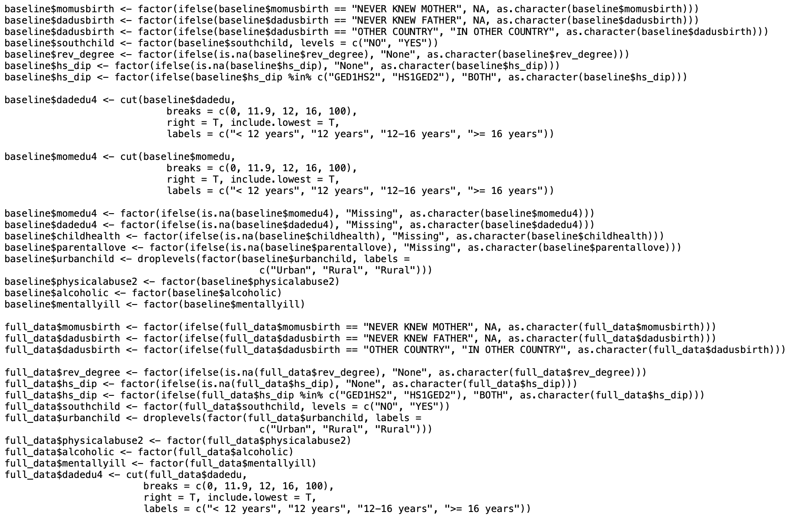
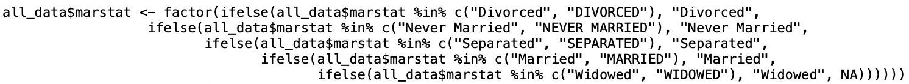

```{r setup, include=FALSE}
options(htmltools.dir.version = FALSE, width = 93)
knitr::opts_chunk$set(fig.dim = c(4.8, 4.5), 
                      fig.align = "center", fig.retina = 2, out.width = "100%", message = FALSE, warning = FALSE, cache = FALSE)
knitr::opts_hooks$set(fig.callout = function(options) {
  if (options$fig.callout) {
    options$echo <- FALSE
    options$out.height <- "99%"
    options$fig.width <- 16
    options$fig.height <- 8
  }
  options
})
library(tidyverse)
reveal <- function(name, num) {
  content <- knitr:::knit_code$get(name)
  last_line <- which(str_detect(content, "\\+"))[num]
  if (is.na(last_line)) last_line <- length(content)
  if (num == 1) {
    first_line <- 1
    } else {
    first_line <- which(str_detect(content, "\\+"))[num - 1] + 1
    }
  content[last_line] <- str_remove(content[last_line], "\\+")
  new_lines <- paste0(content[first_line:last_line], " #<<")
  orig_lines <- if (num == 1) 0 else 1:(first_line-1)
  c(content[orig_lines], new_lines)
}
repeat_code <- function(name) {
  content <- knitr:::knit_code$get(name)
  str_remove_all(content, "`")
}
```
```{css, echo=FALSE}
/* custom.css */

.left-code {
  #color: #777;
  width: 43%;
  height: 92%;
  float: left;
  #font-size: 0.8em;
  position: absolute;
}
.right-plot {
  width: 50%;
  float: right;
  padding-left: 5%;
}
.left-col {
  width: 60%;
  float: left;
  position: absolute;
}
.right-col {
  width: 30%;
  float: right;
  padding-left: 5%;
}
.plot-callout {
  height: 225px;
  width: 450px;
  bottom: 5%;
  right: 5%;
  position: absolute;
  padding: 0px;
  z-index: 100;
}
.plot-callout img {
  width: 100%;
  border: 4px solid #23373B;
}

h4 {
  color: #F97B64;
  font-size: 22px;
  text-align: center;
}

h1, h2, h3, h4 {
  margin-top:2 !important;
}

h1 {
  font-size:45px !important;
}
h2 {
  font-size:40px !important;
}

.inverse h1, .inverse h2, .inverse h3 {
  color: #1F4257;
}
.remark-slide thead, .remark-slide tr:nth-child(2n) {
  background-color: white;
}
.title-slide, .title-slide h1, .title-slide h2, .title-slide h3 {
  color: #1F4257;
    background-color:rgba(236, 236, 236, .75)
}
    
.title-slide {
  background-image: url("img/binders.jpg");
  background-size: cover;
}
.remark-slide-content {
  padding-top: 0;
  padding-left: 40px;
  padding-right: 40px;
  padding-bottom: 10px;
}
th, td {
 padding: 0;
}
```
```{r xaringan-themer, include=FALSE}
library(xaringanthemer)
duo_accent(text_font_size = 25,
  primary_color = "#1F4257",
  secondary_color = "#F97B64",
  header_font_google = google_font("Lexend Deca"),
  text_font_google = google_font("Noto Sans"),
  header_h1_font_size = 45,
  header_h2_font_size = 40
)
```

# Agenda

### Day 1: Figures

### Day 2: Selecting, filtering, and mutating

### Day 3: Grouping and tables

### Day 4: Functions

### Day 5: Analyze your data

---

# Agenda

### Day 1: Figures

```
ggplot(data = {data}) +
      <geom>(aes(x = {xvar}, y = {yvar}, <characteristic> = {othvar}, ...),
             <characteristic> = "value", ...) +
      facet_<facettype>(vars({othvar})) +
      scale_<scalename>_<scaletype>(name = "name",
                                    <options> = c("options"),
                                    ...) +
      theme_<themename>()
```

---

# Agenda

### Day 1: Figures

```{r, echo = FALSE}
library(tidyverse)
nlsy <- read_csv(here::here("data", "nlsy_cc.csv"))
colnames(nlsy) <- c("glasses", "eyesight", "sleep_wkdy", "sleep_wknd",
                    "id", "nsibs", "samp", "race_eth", "sex", "region", 
                    "income", "res_1980", "res_2002", "age_bir")
```
```{r fig-ex, fig.show = "hide", fig.dim = c(5.8, 3)}
ggplot(data = nlsy) +
  geom_histogram(aes(x = income, y = ..density.., fill = factor(region)),
                 bins = 40) +
  scale_x_sqrt(breaks = c(1000, 10000, 25000, 50000)) +
  scale_fill_discrete(name = "Region", 
                      labels = c("Northeast", "North Central", "South", "West")) +
  facet_grid(rows = vars(region)) +
  labs(x = "Income", title = "NLSY 1979 income by US region") +
  theme_minimal()
```

---
# Agenda

### Day 1: Figures

`)

---
# Agenda

### Day 1: Figures

- We can build up figures using the `ggplot2` package by adding pieces using `+`
--

- These pieces follow a "grammar" which we use to map variables to the graph and specify colors, axes, etc.
--

- ggplot is not easy to master but with it you can do almost anything you want!
--

- There are lots of resources and examples online! 

--

#### I don't think I've ever made a figure without Googling something! ("remove ggplot legend" is probably my most searched term ever)

---
### I'm not alone!

<blockquote class="twitter-tweet"><p lang="en" dir="ltr">I remembered how to remove legend titles in ggplot without looking it up AMA</p>&mdash; Katharine Egan (@katharine_egan) <a href="https://twitter.com/katharine_egan/status/1063173668392583168?ref_src=twsrc%5Etfw">November 15, 2018</a></blockquote> <script async src="https://platform.twitter.com/widgets.js" charset="utf-8"></script>

<blockquote class="twitter-tweet"><p lang="en" dir="ltr">I have easily googled “remove legend ggplot” 500+ times. It’s my R kryptonite. I’m surprised google chrome doesn’t just open at that page or, at least, shout at me to remember this time. <a href="https://twitter.com/hashtag/rstats?src=hash&amp;ref_src=twsrc%5Etfw">#rstats</a> <a href="https://twitter.com/hashtag/ggplot2?src=hash&amp;ref_src=twsrc%5Etfw">#ggplot2</a>. Anyone else have a similar blind spot for a frequently used piece of code?</p>&mdash; Ben L (@snoylnimajneb) <a href="https://twitter.com/snoylnimajneb/status/1081249196978647040?ref_src=twsrc%5Etfw">January 4, 2019</a></blockquote> <script async src="https://platform.twitter.com/widgets.js" charset="utf-8"></script>

<blockquote class="twitter-tweet"><p lang="en" dir="ltr">How many times do you need to google &#39;how to remove ggplot legend&#39; before unlocking the achievement? <a href="https://twitter.com/hashtag/rstats?src=hash&amp;ref_src=twsrc%5Etfw">#rstats</a> <a href="https://twitter.com/hashtag/ggplot?src=hash&amp;ref_src=twsrc%5Etfw">#ggplot</a></p>&mdash; Luke Browne (@lukembrowne) <a href="https://twitter.com/lukembrowne/status/1085286367947513856?ref_src=twsrc%5Etfw">January 15, 2019</a></blockquote> <script async src="https://platform.twitter.com/widgets.js" charset="utf-8"></script>

<blockquote class="twitter-tweet" data-conversation="none"><p lang="en" dir="ltr">I google how to remove the legend title from a ggplot every time. I once committed to copying it to a post-it note and sticking it to my monitor, which I did. Then I lost the post-it and have now returned to my previous behavior.</p>&mdash; Thomas J. Leeper (@thosjleeper) <a href="https://twitter.com/thosjleeper/status/1147880970877583362?ref_src=twsrc%5Etfw">July 7, 2019</a></blockquote> <script async src="https://platform.twitter.com/widgets.js" charset="utf-8"></script>

---

# Agenda

### Day 1: Figures ✅

### Day 2: Selecting, filtering, and mutating

### Day 3: Grouping and tables

### Day 4: Functions

### Day 5: Analyze your data

---

# Agenda

### Day 1: Figures ✅

### Day 2: Selecting, filtering, and mutating

#### a.k.a How to manipulate your data to look like you want it to look (without making mistakes!)

---

# Example

```{r, eval = FALSE}

... scale_fill_discrete(name = "Region",
                        labels = c("Northeast", 
                                   "North Central",
                                   "South", 
                                   "West"))
```

### Many of you asked: but how do we know what order they're in?

```{r}
table(nlsy$region)
```

---
# Labeling "factor" variables

- R's version of categorical variables are called factors
- The function to make them is just `factor()`, as we saw in our figures

```{r first-fact, eval = FALSE}
summary(nlsy$region)
summary(`factor`(nlsy$region))
```
```{r, code=repeat_code("first-fact"), echo = FALSE}
```
#### We want to make the store `region` as a factor permanently (and, later, give it better names...)

---
# Creating a new variable

```{r}
nlsy$region_factor <- factor(nlsy$region)
```

#### We can make a new variable out of anything, not just factors

```{r}
nlsy$age_bir_cent <- nlsy$age_bir - mean(nlsy$age_bir)
nlsy$dataset <- "NLSY"
```
```{r, echo = FALSE}
nlsy[,c("region", "region_factor", "age_bir", "age_bir_cent", "dataset")]
```

---
# 💰💲💵💸🤑

### Very quickly your code can get overrun with dollar signs (and parentheses, and arrows)


---
# Prettier way to make new variables: `mutate()`

```{r}
nlsy <- mutate(nlsy,
               region_factor = factor(region),
               age_bir_cent = age_bir - mean(age_bir),
               dataset = "NLSY"
               )
```
#### We can refer to variables within the same dataset without the $ notation

---
# `mutate()` tips and tricks

You still need to store your dataset somewhere, so make sure to include the assignment arrow

- Good practice to make new copies with different names as you go along
- R is smart about data storage, so it won't actually copy all of your data (i.e., you won't run out of room with 50 copies of almost identical datasets)
- You can refer immediately to variables you just made:

```{r ref-mut, eval = FALSE}
nlsy_new <- mutate(nlsy,
                   `age_bir_cent` = age_bir - mean(age_bir),
                   age_bir_stand = `age_bir_cent` / sd(`age_bir_cent`)
                   )
```
```{r, code=repeat_code("ref-mut"), echo = FALSE}
```

---

# My favorite R function: `case_when()`

### I used to write endless strings of `ifelse()` statements

If A is TRUE, then B; if not, then if C is true, then D; if not, then if E is true, then F; if not,

#### Are you confused yet?


---
# `case_when()`

```{r}
nlsy <- mutate(nlsy, slp_cat_wkdy = case_when(
                                              sleep_wkdy < 5 ~ "little",
                                              sleep_wkdy < 7 ~ "some",
                                              sleep_wkdy < 9 ~ "ideal",
                                              sleep_wkdy < 12 ~ "lots",
                                              TRUE ~ NA_character_
                                              )
               )

# note that table doesn't show NAs! can be dangerous!
table(nlsy$slp_cat_wkdy, nlsy$sleep_wkdy)
```

---
# `case_when()`

### Syntax

- Ask a question (i.e., something that will give `TRUE` or `FALSE`) on the left-hand side of the `~`
- If `TRUE`, variable will take on value of whatever is on the right-hand side of the `~`
- Proceeds in order ... if TRUE, takes that value and stops
- If you want some default value, you can end with `TRUE ~ {something}`, which every observation will get if everything else is `FALSE`
- Must make everything the same type, including missing values (`NA_character_`, `NA_real_` generally)

---
# `case_when()`

### Example:
```{r}
nlsy <- mutate(nlsy, total_sleep = case_when(
                                             sleep_wknd > 8 & sleep_wkdy > 8 ~ 1,
                                             sleep_wknd + sleep_wkdy > 15 ~ 2,
                                             sleep_wknd - sleep_wkdy > 3 ~ 3,
                                             TRUE ~ NA_real_
                                             )
               )
```

- Which value would someone with `sleep_wknd = 8` and `sleep_wkdy = 4` go? 
- What about someone with  `sleep_wknd = 11` and `sleep_wkdy = 4`? 
- What about someone with `sleep_wknd = 7` and `sleep_wkdy = 7`?


---
class: inverse
# Exercises `1`

.center[<iframe src="https://giphy.com/embed/3oEdv4bP4Ahh3mj4s0" width="360" height="270" frameBorder="0" class="giphy-embed" allowFullScreen></iframe><p><a href="https://giphy.com/gifs/matthewjocelyn-weird-mutant-mutate-3oEdv4bP4Ahh3mj4s0"></a></p>
]

1. Using the NLSY data and `mutate()`, make a standardized (centered at the mean, and divided by the standard deviation) version of income.
2. Do the same thing, but using income on the log scale. Look at this variable using `summary()`. Can you figure out what happened? (Hint: look at log(income).)
3. Redo question 2, but if you are not able to calculate log(income) for an observation, replace it with a missing value (using `case_when()`). This time, when you standardize log(income), you'll have to use `na.rm = TRUE` to remove missing values both when you take the mean and the standard deviation.

```{r, echo = FALSE, eval = FALSE}
# nlsy <- mutate(nlsy,
#                income_stand = (income - mean(income) ) / sd(income),
#                log_income = log(income),
#                log_income_stand = (log_income - mean(log_income) ) / sd(log_income)
# )
# summary(nlsy$log_income_stand)
# summary(nlsy$log_income)
# nlsy <- mutate(nlsy,
#                income_stand = (income - mean(income) ) / sd(income),
#                log_income = case_when(
#                  income == 0 ~ NA_real_,
#                  TRUE ~ log(income)
#                ),
#                log_income_stand = (log_income - mean(log_income, na.rm = TRUE) ) / sd(log_income, na.rm = TRUE)
# )
# summary(nlsy$log_income_stand)
```

---

# OK, but what about those factors?!

Let's look at the variable we made describing someone's weekday sleeping habits:

```{r}
nlsy <- mutate(nlsy, slp_cat_wkdy = case_when(
                                              sleep_wkdy < 5 ~ "little",
                                              sleep_wkdy < 7 ~ "some",
                                              sleep_wkdy < 9 ~ "ideal",
                                              sleep_wkdy < 12 ~ "lots",
                                              TRUE ~ NA_character_
                                              )
               )

summary(nlsy$slp_cat_wkdy)
```

---
# Character variables aren't very helpful in analysis

Like the {1, 2, 3, 4} region variable, we want to turn this variable into a categorical variable. This time it already comes with names!

```{r new-fact, eval = FALSE}
# I'm just going to replace this variable, instead of making a new one, 
# by giving it the same name a before
nlsy <- mutate(nlsy, slp_cat_wkdy = `factor`(slp_cat_wkdy))
summary(nlsy$slp_cat_wkdy)
```
```{r, code=repeat_code("new-fact"), echo = FALSE}
```
#### Much better, but what's the deal with that order?

---
# `forcats` package

.left-col[
- Tries to make working with factors safe and convenient
- Functions to make new levels, reorder levels, combine levels, etc.
- All the functions start with `fct_` so they're easy to find using tab-complete!
- Automatically loads with `library(tidyverse)`
]

.right-col[

]

---
# Reorder factors

The `fct_relevel()` function allows us just to rewrite the names of the categories out in the order we want them (safely).

```{r fct-relevel, eval = FALSE}
nlsy <- mutate(nlsy, slp_cat_wkdy_ord = `fct_relevel`(slp_cat_wkdy, "little", 
                                                                    "some", 
                                                                    "ideal", 
                                                                    "lots"
                                                    )
               )
```
```{r, code=repeat_code("fct-relevel"), echo = FALSE}
```
```{r}
summary(nlsy$slp_cat_wkdy_ord)
levels(nlsy$slp_cat_wkdy_ord)
```

---
### What if you misspell something?

```{r misspell, warning = TRUE, eval = FALSE}
nlsy <- mutate(nlsy, slp_cat_wkdy_ord2 = fct_relevel(slp_cat_wkdy, "little", 
                                                                  `"same"`, 
                                                                   "ideal", 
                                                                   "lots"
                                                     )
               )
```{r, code=repeat_code("misspell"), echo = FALSE, warning = TRUE}
```
```{r}
summary(nlsy$slp_cat_wkdy_ord2)
levels(nlsy$slp_cat_wkdy_ord2)
```

#### You get a warning, and levels you didn't mention are pushed to the end.

---

# Other orders

While amount of sleep has an inherent ordering, region doesn't. Also, we still need to give the numbers names!

From the codebook, I know that:
```{r fct-recode, eval = FALSE}
nlsy <- mutate(nlsy, region_fact = factor(region),
                     region_fact = `fct_recode`(region_fact,
                                                 "Northeast" = "1",
                                                 "North Central" = "2",
                                                 "South" = "3",
                                                 "West" = "4"
                                                )
               )
table(nlsy$region)
```
```{r, code=repeat_code("fct-recode"), echo = FALSE}
```
```{r}
summary(nlsy$region_fact) # since table() doesn't show NAs
```

---
# Other orders

So now I can reorder them as I wish -- how about from most people to least?
```{r fct-infreq, eval = FALSE}
nlsy <- mutate(nlsy, region_fact = `fct_infreq`(region_fact))
summary(nlsy$region_fact)
```
```{r, code=repeat_code("fct-infreq"), echo = FALSE}
```
Or the reverse of that?
```{r fct-rev, eval = FALSE}
nlsy <- mutate(nlsy, region_fact = `fct_rev`(region_fact))
summary(nlsy$region_fact)
```
```{r, code=repeat_code("fct-rev"), echo = FALSE}
```

---
# Add and remove

Recall that we made it so that the sleep variable had missing values, perhaps because we thought they were outliers:

```{r fct-na, eval = FALSE}
nlsy <- mutate(nlsy, slp_cat_wkdy_out = `fct_explicit_na`(slp_cat_wkdy, na_level = "outlier"))
summary(nlsy$slp_cat_wkdy_out)
```
```{r, code=repeat_code("fct-na"), echo = FALSE}
```
Or maybe we want to combine some levels that don't have a lot of observations in them:
```{r fct-collapse, eval = FALSE}
nlsy <- mutate(nlsy, slp_cat_wkdy_comb = `fct_collapse`(slp_cat_wkdy, 
                                                         "less" = c("little", "some"),
                                                         "more" = c("ideal", "lots")
                                                       )
              )
summary(nlsy$slp_cat_wkdy_comb)
```
```{r, code=repeat_code("fct-collapse"), echo = FALSE}
```

---
# Add and remove

Or we can have R choose which ones to combine based on how few observations they have:
```{r fct-lump, eval = FALSE}
nlsy <- mutate(nlsy, slp_cat_wkdy_lump = `fct_lump`(slp_cat_wkdy, n = 2))
summary(nlsy$slp_cat_wkdy_lump)
```

```{r, code=repeat_code("fct-lump"), echo = FALSE}
```

#### There are 25 `fct_` functions in the package. The sky's the limit when it comes to manipulating your categorical variables in R!

---
class:inverse
# Exercises `2`

.center[
<iframe src="https://giphy.com/embed/ExMGjbktr4phe" width="360" height="212" frameBorder="0" class="giphy-embed" allowFullScreen></iframe><p><a href="https://giphy.com/gifs/aww-edition-ExMGjbktr4phe"></a></p>
]

1. Turn the eyesight variable into a factor variable. The numbers 1-5 correspond to excellent, very good, good, fair, and poor. Make sure that categories are in an appropriate order.
2. Use two different methods to combine the worst two categories of eyesight into one category.
3. Make a new categorical income variable with at least 3 levels (you can choose the cutoffs). Make a bar graph with this new variable where the bars are in the correct order from low to high and are colored increasingly dark shades of green. (Hint: http://colorbrewer2.org; `scale_color_brewer()`)

```{r, eval = FALSE, echo = FALSE}
# nlsy <- mutate(nlsy,
#                income_cat = case_when(
#                  income < 15000 ~ "low",
#                  income < 50000 ~ "mid",
#                  TRUE ~ "high"
#                ))
# ggplot(nlsy) +
#   geom_bar(aes(income_cat))
```

---

# Selecting the variables you want

### We've made approximately 1000 new variables!

You don't want to keep them all. You'll get confused, and when you go to summarize your data it will take pages.

Luckily there's an easy way to select the variables you want: `select()`!

```{r}
nlsy_subs <- `select`(nlsy, id, income, eyesight, sex, region)
nlsy_subs
```

---

# `select()` syntax

- Like `mutate()`, the first argument is the dataset you want to select from
- Then you can just list the variables you want!
- Or you can list the variables you *don't* want, preceded by a minus sign (`-`)
- There are also a lot of "helpers"!

```{r neg-sel, eval = FALSE}
select(nlsy_subs, `-`id, `-`region)
```
```{r, code=repeat_code("neg-sel"), echo = FALSE}
```

---
# `one_of()`

Notice that the variable names we used in `select()` weren't in quotation marks.

Let's say you have a list of column names that you want. Then you can use `one_of()` to choose them.

```{r}
cols_I_want <- c("age_bir", "nsibs", "region")
select(nlsy, `one_of`(cols_I_want))
```

---
# Other select helpers

Do you have a lot of variables that are alike in some way? And you want to find all of them? Try:
- `starts_with()`
- `contains()`
- `ends_with()`

```{r}
select(nlsy, `starts_with`("slp"))
```

---
# Reordering variables

Sometimes you don't want to get rid of the other variables, you just want to move things around. Then use `everything()` as the last argument in `select()` to get all the rest.

Let's move `id` to be the first column:

```{r everything, eval = FALSE}
select(nlsy, id, `everything()`)
```
```{r, code=repeat_code("everything"), echo = FALSE}
```

---
class:inverse
# Exercises `3`

.center[
<iframe src="https://giphy.com/embed/QgyIXWzyQZPuo" width="247" height="270" frameBorder="0" class="giphy-embed" allowFullScreen></iframe><p><a href="https://giphy.com/gifs/now-come-tong-QgyIXWzyQZPuo"></a></p>
]

1. Create mean-centered versions of "age_bir", "nsibs", "income", and the two sleep variables. Use the same ending (e.g., "_cent") for all of them. Then make a new dataset of just the centered variables using `select()` and a helper.
2. You may have added a lot of variables to the original dataset by now. Create a dataset called `nlsy_orig` that contains only the variables we started off with, using the vector of names we originally used to name the columns and the `one_of()` helper.
3. Look at `help(select)`. You'll notice that `rename()` is a related function. Looking at the examples to help, rename "age_bir" to "age_1st_birth" without making a new column.

---

# Subsetting data

We usually don't do an analysis in an *entire* dataset. We usually apply some eligibility criteria to find the people who we will analyze. One function we can use to do that in R is `filter()`.

```{r}
wear_glasses <- `filter`(nlsy, glasses == 1)

nrow(wear_glasses)
summary(wear_glasses$glasses)
```

---
# `filter()` syntax

- Like the others, we give `filter()` the dataset first, then we give it a series of criteria that we want to subset our data on. 
- As with `case_when()`, these criteria should be questions with `TRUE`/`FALSE` answers. We'll keep all those rows for which the answer is `TRUE`.
- If there are multiple criteria, we can connect them with `&` or just by separating with commas, and we'll get back only the rows that answer `TRUE` to all of them.

```{r}
yesno_glasses <- filter(nlsy, glasses == 0, glasses == 1)

nrow(yesno_glasses)

glasses_great_eyes <- filter(nlsy, glasses == 1, eyesight == 1)

nrow(glasses_great_eyes)
```

---
# Logicals in R

When we used `case_when()`, we got `TRUE`/`FALSE` answers when we asked whether a variable was `>` or `<` some number, for example.

When we want to know if something is

- equal: `==`
- not equal: `!=`
- greater than or equal to: `>=`
- less than or equal to: `<=`

We also can ask about multiple conditions with `&` (and) and `|` (or).

---
# Or statements

To get the extreme values of eyesight (1 and 5), we would do something like:

```{r}
extreme_eyes <- filter(nlsy, eyesight == 1 | eyesight == 5)
table(extreme_eyes$eyesight)
```
We could of course do the same thing with a factor variable:

```{r}
some_regions <- filter(nlsy, region_fact == "Northeast" | region_fact == "South")
table(some_regions$region_fact)
```

---
# Multiple "or" possibilities

Often we have a number of options for one variable that would meet our eligibility criteria. R's special `%in%` function comes in handy here:

```{r}
more_regions <- filter(nlsy, region_fact %in% c("South", "West", "Northeast"))
table(more_regions$region_fact)
```

If the variable's value is any one of those values, it will return `TRUE`.

---
# More `%in%`

This function works outside of the `filter()` function, of course!

```{r}
7 %in% c(4, 6, 7, 10)
5 %in% c(4, 6, 7, 10)
```

---
# Opposite of `%in%`

This is annoying. We can't say "not in" with the syntax `%!in%` or something like that. We have to put the `!` before the question to basically make it the opposite of what it otherwise would be.

```{r}
!7 %in% c(4, 6, 7, 10)
!5 %in% c(4, 6, 7, 10)
```

```{r}
northcentralers <- filter(nlsy, !region_fact %in% c("South", "West", "Northeast"))
table(northcentralers$region_fact)
```

---
# Other questions

R offers a number of shortcuts to use when determining whether values meet certain criteria:

- `is.na()`: is it a missing value? 
- `is.finite()` / `is.infinite()`: when you might have infinite values in your data
- `is.factor()`: asks whether some variable is a factor

You can find lots of these if you tab-complete `is.` or `is_` (the latter are tidyverse versions). Most you will never find a use for!

---
# Putting it all together


```{r}
my_data <- filter(nlsy, 
                  age_bir_cent < 1,
                  sex != 1,
                  nsibs %in% c(1, 2, 3),
                  !is.na(slp_cat_wkdy))

summary(select(my_data, age_bir_cent, sex, nsibs, slp_cat_wkdy))
```

---
# Putting it all together

```{r}
oth_dat <- filter(nlsy, 
                  (age_bir_cent < 1) &
                  (sex != 1 | nsibs %in% c(1, 2, 3)) &
                  !is.na(slp_cat_wkdy))

summary(select(oth_dat, age_bir_cent, sex, nsibs, slp_cat_wkdy))
```

---
class:inverse
# Exercises `4`

.center[
<iframe src="https://giphy.com/embed/3o85xmXTiPM4OCilcQ" width="480" height="270" frameBorder="0" class="giphy-embed" allowFullScreen></iframe><p><a href="https://giphy.com/gifs/dccomics-batman-dc-comics-3o85xmXTiPM4OCilcQ"></a></p>
]

1. Create a dataset with all the observations that get over 7 hours of sleep on both weekends and weekdays *or* who have an income greater than/equal to 20,000 and less than/equal to 50,000.
2. Create a dataset that consists *only* of the missing values in `slp_cat_wkdy`. Check how many rows it has (there should be 3!).
3. Look up the `between()` function in help. Figure out how to use this to answer question 1, when choosing people whose income is between 20,000 and 50,000. Check to make sure you get the same number of rows.

---
# Challenge

### Deal with the disaster that are the residence categories across NLSY years!

Sometimes when a study is conducted across many years, the questions and/or possible answers change slightly. This is **really annoying**. R to the rescue!

```{r, eval = FALSE, echo = FALSE}
# nlsy_full <- read_csv(here::here("data", "nlsy.csv"))
# nlsy_full$R0402800 <- factor(nlsy_full$R0402800,
#   levels = c(1.0, 2.0, 3.0, 4.0, 5.0, 6.0, 11.0, 12.0, 13.0, 14.0, 15.0, 16.0, 17.0, 18.0, 19.0),
#   labels = c(
#     "ABOARD SHIP, BARRACKS",
#     "BACHELOR, OFFICER QUARTERS",
#     "DORM, FRATERNITY, SORORITY",
#     "HOSPITAL",
#     "JAIL",
#     "OTHER TEMPORARY QUARTERS",
#     "OWN DWELLING UNIT",
#     "ON-BASE MIL FAM HOUSING",
#     "OFF-BASE MIL FAM HOUSING",
#     "ORPHANAGE",
#     "RELIGIOUS INSTITUTION",
#     "OTHER INDIVIDUAL QUARTERS",
#     "PARENTAL",
#     "HHI CONDUCTED WITH PARENT",
#     "R IN PARENTAL HOUSEHOLD"
#   )
# )
# nlsy_full$R7090700 <- factor(nlsy_full$R7090700,
#   levels = c(1.0, 2.0, 3.0, 4.0, 5.0, 6.0, 11.0, 12.0, 13.0, 15.0, 16.0, 19.0),
#   labels = c(
#     "OPEN BAY OR TROOP BARRACKS, ABOARD SHIP",
#     "BACHELOR ENLISTED OR OFFICER QUARTERS",
#     "DORMITORY, FRATERNITY OR SORORITY",
#     "HOSPITAL",
#     "JAIL",
#     "OTHER TEMPORARY INDIVIDUAL QUARTERS",
#     "OWN DWELLING UNIT",
#     "ON-BASE MILITARY FAMILY HOUSING",
#     "OFF-BASE MILITARY FAMILY HOUSING",
#     "CONVENT, MONASTERY, OTHER RELIGIOUS INSTITUTE",
#     "OTHER INDIVIDUAL QUARTERS",
#     "RESPONDENT IN PARENT HOUSEHOLD"
#   )
# )
# write_rds(nlsy_full, here::here("data", "nlsy.rds"))
```


```{r, echo = FALSE}
nlsy_full <- read_rds(here::here("data", "nlsy.rds"))
colnames(nlsy_full) <- c(
  "glasses", "eyesight", "sleep_wkdy", "sleep_wknd",
  "id", "nsibs", "samp", "race_eth", "sex", "region",
  "income", "res_1980", "res_2002", "age_bir"
)
summary(select(nlsy_full, starts_with("res")))
```

---
# Challenge

```{r}
levels(nlsy_full$res_1980)
levels(nlsy_full$res_2002)
```

---
.pull-left[
### `res_1980`


value | label
------|----------------------
1  | ABOARD SHIP, BARRACKS
2  | BACHELOR, OFFICER QUARTERS
3  | DORM, FRATERNITY, SORORITY
4  | HOSPITAL
5  | JAIL
6  | OTHER TEMPORARY QUARTERS
11 | OWN DWELLING UNIT
12 | ON-BASE MIL FAM HOUSING
13 | OFF-BASE MIL FAM HOUSING
14 | ORPHANAGE
15 | RELIGIOUS INSTITUTION
16 | OTHER INDIVIDUAL QUARTERS
17 | PARENTAL
18 | HHI CONDUCTED WITH PARENT
19 | R IN PARENTAL HOUSEHOLD
]
.pull-right[
### `res_2002`

value | label
------|----------------------
 1 | OPEN BAY OR TROOP BARRACKS, ABOARD SHIP
 2 | BACHELOR ENLISTED OR OFFICER QUARTERS
 3 | DORMITORY, FRATERNITY OR SORORITY
 5 | JAIL
 4 | HOSPITAL
 6 | OTHER TEMPORARY INDIVIDUAL QUARTERS (SPECIFY)
11 | OWN DWELLING UNIT
12 | ON-BASE MILITARY FAMILY HOUSING
13 | OFF-BASE MILITARY FAMILY HOUSING
15 | CONVENT, MONASTERY, OTHER RELIGIOUS INSTITUTE
16 | OTHER INDIVIDUAL QUARTERS (SPECIFY)
19 | RESPONDENT IN PARENT HOUSEHOLD
]


---
class:inverse

# Challenge
.center[
<iframe src="https://giphy.com/embed/HIrYP4RI9DpLy" width="360" height="248" frameBorder="0" class="giphy-embed" allowFullScreen></iframe><p><a href="https://giphy.com/gifs/cleaning-clean-HIrYP4RI9DpLy"></a></p>
]
 
We'll eventually want to be able to work with these two factor variables together, so we want them to have the same levels.

Your job is to do your best to make each of them into a variable you would like to work with if you were analyzing this data. This may involve combining categories, changing names, etc.

Then make a dataset with only your two better versions of these variables. Only include observations that have a non-missing observation in both years.