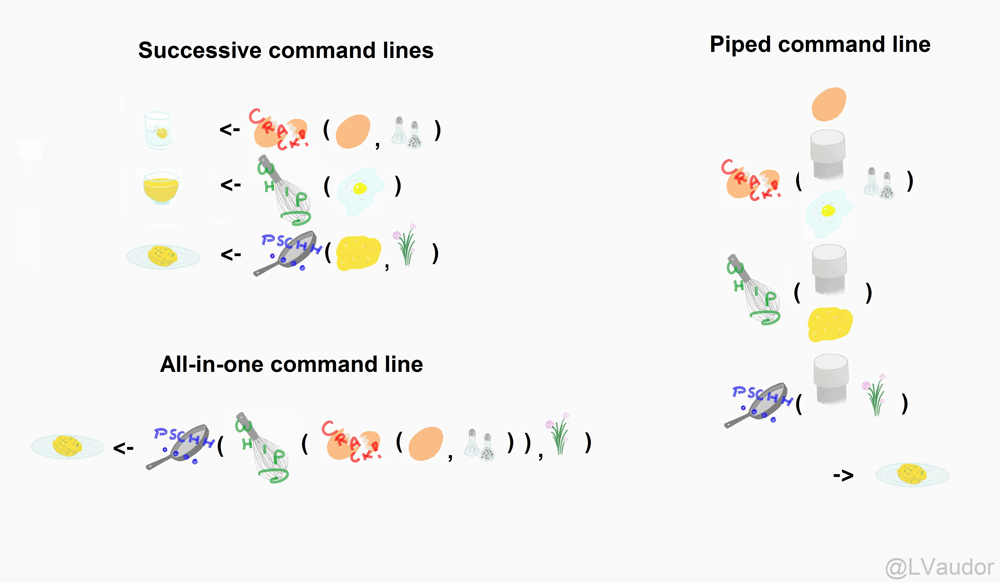

```{r setup, include=FALSE}
options(htmltools.dir.version = FALSE, width = 93)
knitr::opts_chunk$set(fig.dim = c(4.8, 4.5), 
                      fig.align = "center", fig.retina = 2, out.width = "100%", message = FALSE, warning = FALSE, cache = FALSE)
knitr::opts_hooks$set(fig.callout = function(options) {
  if (options$fig.callout) {
    options$echo <- FALSE
    options$out.height <- "99%"
    options$fig.width <- 16
    options$fig.height <- 8
  }
  options
})
library(tidyverse)
library(tableone)
reveal <- function(name, num) {
  content <- knitr:::knit_code$get(name)
  last_line <- which(str_detect(content, "\\+"))[num]
  if (is.na(last_line)) last_line <- length(content)
  if (num == 1) {
    first_line <- 1
    } else {
    first_line <- which(str_detect(content, "\\+"))[num - 1] + 1
    }
  content[last_line] <- str_remove(content[last_line], "\\+")
  new_lines <- paste0(content[first_line:last_line], " #<<")
  orig_lines <- if (num == 1) 0 else 1:(first_line-1)
  c(content[orig_lines], new_lines)
}
repeat_code <- function(name) {
  content <- knitr:::knit_code$get(name)
  str_remove_all(content, "`")
}
```
```{css, echo=FALSE}
/* custom.css */

.left-code {
  #color: #777;
  width: 43%;
  height: 92%;
  float: left;
  #font-size: 0.8em;
  position: absolute;
}
.right-plot {
  width: 50%;
  float: right;
  padding-left: 5%;
}
.left-col {
  width: 60%;
  float: left;
  position: absolute;
}
.right-col {
  width: 30%;
  float: right;
  padding-left: 5%;
}
.plot-callout {
  height: 225px;
  width: 450px;
  bottom: 5%;
  right: 5%;
  position: absolute;
  padding: 0px;
  z-index: 100;
}
.plot-callout img {
  width: 100%;
  border: 4px solid #23373B;
}

h4 {
  color: #F97B64;
  font-size: 26px;
  text-align: center;
}

h1, h2, h3, h4 {
  margin-top:2 !important;
}

h1 {
  font-size:45px !important;
}
h2 {
  font-size:40px !important;
}

.inverse h1, .inverse h2, .inverse h3 {
  color: #1F4257;
}
.remark-slide thead, .remark-slide tr:nth-child(2n) {
  background-color: white;
}
.title-slide, .title-slide h1, .title-slide h2, .title-slide h3 {
  color: #1F4257;
    background-color:rgba(236, 236, 236, .75)
}
    
.title-slide {
  background-image: url("img/tables.jpg");
  background-size: cover;
}
.remark-slide-content {
  padding-top: 0;
  padding-left: 40px;
  padding-right: 40px;
  padding-bottom: 10px;
  font-size: 26px;
}
th, td {
 padding: 0;
}

pre, ol, p {
  margin-bottom: .5rem;
  margin-top: 0.5rem;
}

ul {
  margin-bottom: .5rem;
  margin-top: 0;
}

.big-code .remark-code {
  font-size: 1.5em !important;
  margin: 0;
  width: 100%;
}

```
```{r xaringan-themer, include=FALSE}
library(xaringanthemer)
duo_accent(code_font_size = "1.3rem",
  primary_color = "#1F4257",
  secondary_color = "#F97B64",
  header_font_google = google_font("Lexend Deca"),
  text_font_google = google_font("Noto Sans"),
  header_h1_font_size = 45,
  header_h2_font_size = 40
)
```


# Agenda

### Day 1: Figures

### Day 2: Selecting, filtering, and mutating

### Day 3: Grouping and tables

### Day 4: Functions

### Day 5: Analyze your data

---

# Agenda

### Day 1: Figures

```
ggplot(data = {data}) +
      <geom>(aes(x = {xvar}, y = {yvar}, <characteristic> = {othvar}, ...),
             <characteristic> = "value", ...) +
      facet_<facettype>(vars({othvar})) +
      scale_<scalename>_<scaletype>(name = "name",
                                    <options> = c("options"),
                                    ...) +
      theme_<themename>()
```

---

# Agenda

### Day 1: Figures

```{r, echo = FALSE}
library(tidyverse)
nlsy <- read_csv(here::here("data", "nlsy_cc.csv"))
colnames(nlsy) <- c("glasses", "eyesight", "sleep_wkdy", "sleep_wknd",
                    "id", "nsibs", "samp", "race_eth", "sex", "region", 
                    "income", "res_1980", "res_2002", "age_bir")
```
```{r fig-ex, fig.show = "hide", fig.dim = c(5.8, 3)}
ggplot(data = nlsy) +
  geom_histogram(aes(x = income, y = ..density.., fill = factor(region)),
                 bins = 40) +
  scale_x_sqrt(breaks = c(1000, 10000, 25000, 50000)) +
  scale_fill_discrete(name = "Region", 
                      labels = c("Northeast", "North Central", "South", "West")) +
  facet_grid(rows = vars(region)) +
  labs(x = "Income", title = "NLSY 1979 income by US region") +
  theme_minimal()
```

---
# Agenda

### Day 1: Figures

`)

---
# Agenda

### Day 1: Figures ✅

### Day 2: Selecting, filtering, and mutating

### Day 3: Grouping and tables

### Day 4: Functions

### Day 5: Analyze your data

---

# Agenda

### Day 1: Figures ✅

### Day 2: Selecting, filtering, and mutating

- Make a new variable with `mutate()`
--

- Select the variables you want in your dataset with `select()`
--

- Keep only the observations you want in your dataset with `filter()`
--

- We also looked at categorizing our data with factors and the `forcats` package

---

# Agenda

### Day 1: Figures ✅

### Day 2: Selecting, filtering, and mutating

```{r, eval = FALSE}
nlsy2 <- mutate(nlsy, only = case_when(
                              nsibs == 0 ~ "yes",
                              TRUE ~ "no"))
nlsy3 <- select(nlsy2, id, contains("sleep"), only)
only_kids <- filter(nlsy3, only == "yes")
only_kids
```
```{r, echo = FALSE}
nlsy2 <- mutate(nlsy, only = case_when(
                                 nsibs == 0 ~ "yes",
                                 TRUE ~ "no"))
nlsy3 <- select(nlsy2, id, contains("sleep"), only)
only_kids <- filter(nlsy3, only == "yes")
print(only_kids, n = 4)
```

---

# Agenda

### Day 1: Figures ✅

### Day 2: Selecting, filtering, and mutating ✅

### Day 3: Grouping and tables

---
# Repertoire of functions
.pull-left[
We are doing more and more things to our dataset.

In any data management and/or analysis task, we perform a series of functions to the data until we get some object we want.

Sometimes this can be hard to read/keep track of.

#### Before we add another set of functions...
]
.pull-right[.center[

]]

---
# The pipe
.pull-left[
Certain packages, including `tidyverse`, include a function known as a pipe.

If you have experience with unix programming, you may be familiar with the version of the pipe there: `|`.

R uses this as a pipe: `%>%`
]
.pull-right[.center[


The pipe function is originally from the `magrittr` package, named after René Magritte
]]

---
# We use the pipe to chain together steps
It's like a recipe for our dataset. (example from [Lise Vaudor](http://perso.ens-lyon.fr/lise.vaudor/utiliser-des-pipes-pour-enchainer-des-instructions/))

```{r, out.width = "75%", echo = FALSE}

```

---
# Or like reading a story (or nursery rhyme!)
.pull-left[
```{r, eval = FALSE}
foo_foo <- little_bunny()
bop_on(
  scoop_up(
    hop_through(foo_foo, forest),
    field_mouse),
head)
```
## vs
```{r, eval = FALSE}
foo_foo %>%
  hop_through(forest) %>%
  scoop_up(field_mouse) %>%
  bop_on(head)
```
(example from [Hadley Wickham](https://t.co/Qn4B7Kna2D?amp=1))
]
.pull-right[

]

---
# A natural order of operations
.pull-left[
```{r, eval = FALSE}
leave_house(
  get_dressed(
    get_out_of_bed(
      wake_up(me))))
```

```{r, eval = FALSE}
me <- wake_up(me)
me <- get_out_of_bed(me)
me <- get_dressed(me)
me <- leave_house(me)
```

```{r, eval = FALSE}
me %>%
  wake_up() %>%
  get_out_of_bed() %>%
  get_dressed() %>%
  leave_house()
```
(example from [Andrew Heiss](https://twitter.com/andrewheiss/status/1173743447171354624?s=20))
]
.pull-left[.middle[.center[
<iframe src="https://giphy.com/embed/8vzs8kavEygvK" width="480" height="264" frameBorder="0" class="giphy-embed" allowFullScreen></iframe><p><a href="https://giphy.com/gifs/things-her-most-8vzs8kavEygvK"></a></p>
]]]

---
# Using pipes with functions we already know
.pull-left[
```{r}
nlsy2 <- mutate(nlsy, only = case_when(
  nsibs == 0 ~ "yes",
  TRUE ~ "no"))
nlsy3 <- select(nlsy2, 
   id, contains("sleep"), only)
only_kids <- filter(nlsy3, only == "yes")
only_kids
```
]
.pull-right[
```{r pipe1, eval = FALSE}
only_kids <- nlsy `%>%`
  mutate(only = case_when(
                     nsibs == 0 ~ "yes",
                     TRUE ~ "no")) `%>%`
  select(id, contains("sleep"), only) `%>%`
  filter(only == "yes")
only_kids
```
```{r, code=repeat_code("pipe1"), echo = FALSE}
```
]

---

# Pipes replace the first argument of the next function

```{r, eval = FALSE}
help(mutate)
help(select)
help(filter)
```
### Usage

`mutate(.data, ...)`

`select(.data, ...)`

`filter(.data, ..., .preserve = FALSE)`

---

# Pipes replace the first argument of the next function

.pull-left[
```{r, eval = FALSE}
nlsy2 <- mutate(`nlsy`, only = case_when(
  nsibs == 0 ~ "yes",
  TRUE ~ "no"))
```
]
.pull-right[
```{r, eval = FALSE}
only_kids <- `nlsy` %>%
  mutate(only = case_when(
                     nsibs == 0 ~ "yes",
                     TRUE ~ "no"))
```
]

---
count:true
# Pipes replace the first argument of the next function

.pull-left[
```{r, eval = FALSE}
nlsy2 <- mutate(nlsy, only = case_when(
  nsibs == 0 ~ "yes",
  TRUE ~ "no"))
nlsy3 <- select(`nlsy2`, 
   id, contains("sleep"), only)
```
]
.pull-right[
```{r, eval = FALSE}
only_kids <- `nlsy %>%`
  `mutate(only = case_when(`
                     `nsibs == 0 ~ "yes",`
                     `TRUE ~ "no"))` %>%
  select(id, contains("sleep"), only)
```
]

---
count:true
# Pipes replace the first argument of the next function

.pull-left[
```{r, eval = FALSE}
nlsy2 <- mutate(nlsy, only = case_when(
  nsibs == 0 ~ "yes",
  TRUE ~ "no"))
nlsy3 <- select(nlsy2, 
   id, contains("sleep"), only)
only_kids <- filter(`nlsy3`, only == "yes")

```
]
.pull-right[
```{r, eval = FALSE}
only_kids <- `nlsy %>%`
  `mutate(only = case_when(`
                     `nsibs == 0 ~ "yes",`
                     `TRUE ~ "no")) %>%`
  `select(id, contains("sleep"), only)` %>%
  filter(only == "yes")
```
]

---
# Instructions

1. Create a variable called `slp_cat_wkday` categorizing weekday sleep.
2. Subset the dataset to only include people with missing values.
2. Remove non-sleep-related variables from the dataset.
4. Call your finished dataset `missing_sleep`.

```{r}
nlsy <- mutate(nlsy, slp_cat_wkdy = case_when(
  sleep_wkdy < 5 ~ "little",
  sleep_wkdy < 7 ~ "some",
  sleep_wkdy < 9 ~ "ideal",
  sleep_wkdy < 12 ~ "lots",
  TRUE ~ NA_character_))
missing_sleep <- filter(nlsy, is.na(slp_cat_wkdy))
missing_sleep <- select(missing_sleep, starts_with("slp"), contains("sleep"))
missing_sleep
```

---
class:inverse
# Exercises 1
.center[
<iframe src="https://giphy.com/embed/aSZSj0mT8f6tW" width="240" height="233" frameBorder="0" class="giphy-embed" allowFullScreen></iframe><p><a href="https://giphy.com/gifs/dog-chores-aSZSj0mT8f6tW"></a></p>
]
1. Follow the instructions on the previous slide using pipes. (The code on the previous slide is provided in today's script.)
2. Experiment with switching up the "order of operations". Can you complete the instructions in a different order and get the same result? Can you think of a situation when you might not be able to do so?

---
# Summary statistics

We have seen that we can get certain summary statistics about our data with the `summary()` function, which we can use either on an entire dataframe/tibble, or on a single variable.

```{r}
summary(missing_sleep)
summary(nlsy$income)
```

---
# Summary statistics

We can also apply certain functions to a variable(s) to get a single statistic: `mean()`, `median()`, `var()`, `sd()`, `cov`, `cor()`, `min()`, `max()`, `quantile()`, etc.

```{r}
median(nlsy$age_bir)
cor(nlsy$sleep_wkdy, nlsy$sleep_wknd)
quantile(nlsy$income, probs = c(0.1, 0.9))
```

---
# Summary statistics

But what if we want a lot of summary statistics -- just not those that come with the `summary()` function?

- For example, it doesn't give us a standard deviation!

### Introducing `summarize()`

```{r}
summarize(nlsy, 
          med_age_bir = median(age_bir),
          cor_sleep = cor(sleep_wkdy, sleep_wknd),
          ten_pctle_inc = quantile(income, probs = 0.1),
          ninety_pctle_inc = quantile(income, probs = 0.9))
```

---

# `summarize()` specifics

### Usage
`summarize(.data, ...)`

### Arguments

`... Name-value pairs of summary functions. The name will be the name of the variable in the result. The value should be an expression that returns a single value like min(x), n(), or sum(is.na(y)).`

---
# `summarize()` specifics

Important to note:

- Takes a dataframe as its first argument. That means we can use pipes!
- Returns a tibble -- helpful if you want to use those values in a figure or table.
- Can give the summary statistics names.
- Can ask for any type of function of the variables (including one you make up yourself). BUT it has to return only a single value.
  - For example, if you want multiple quantiles, you have to ask separately:
  
```{r}
nlsy %>% summarize(q.1 = quantile(age_bir, probs = 0.1),
                   q.2 = quantile(age_bir, probs = 0.2),
                   q.3 = quantile(age_bir, probs = 0.3),
                   q.4 = quantile(age_bir, probs = 0.4),
                   q.5 = quantile(age_bir, probs = 0.5))
```

---
# Combining summarize with other functions

Because we can pipe, we can also look at statistics of variables that we make using `mutate()`, in a dataset we've subsetted with `filter()`.

#### All at once!

```{r}
nlsy %>%
  mutate(age_bir_stand = (age_bir - mean(age_bir)) / sd(age_bir)) %>%
  filter(sex == 1) %>%
  summarize(mean_men = mean(age_bir_stand))
```

---
class:inverse
# Exercises 2
.center[
<iframe src="https://giphy.com/embed/dsKnRuALlWsZG" width="480" height="271" frameBorder="0" class="giphy-embed" allowFullScreen></iframe><p><a href="https://giphy.com/gifs/the-office-steve-carell-michael-scott-dsKnRuALlWsZG"></a></p>
]


1. Among the only children, find the correlation between hours of sleep on weekdays and weekends.
2. Create a variable that is 1 if an observation has an income between 20,000 and 30,000, and 0 otherwise. Calculate the proportion of people in the dataset who fit that criterion.
3. Recreate the `summary()` function using `summarize()` (i.e., produce all the same statistics for a variable of your choice.)


---
# What if we want both groups at once?

```{r}
nlsy %>%
  filter(sex == 1) %>%
  summarize(age_bir_men = mean(age_bir))

nlsy %>%
  filter(sex == 2) %>%
  summarize(age_bir_women = mean(age_bir))
```

---
# We can "group" tibbles using `group_by()`

We can tell it's "grouped" and how many groups there are by printing out the data.

The data itself won't look different, but we'll be able to perform grouped functions on it.

```{r, eval = FALSE}
nlsy_by_region <- group_by(nlsy, region)
nlsy_by_region
```
```{r, echo = FALSE}
nlsy_by_region <- group_by(nlsy, region)
print(nlsy_by_region, n = 8)
```

---
# `group_by()`

Like the other functions we've seen, we can use pipes:

```{r, eval = FALSE}
nlsy %>%
  mutate(income_stand = (income - mean(income))/sd(income)) %>%
  select(id, region, income_stand, race_eth, sex) %>%
  group_by(race_eth)
```

```{r, echo = FALSE}
nlsy %>%
  mutate(income_stand = (income - mean(income))/sd(income)) %>%
  select(id, region, income_stand, race_eth, sex) %>%
  group_by(race_eth) %>%
  print(n = 8)
```

---
# Stratify with `group_by() %>% summarize()`

This function is especially important when calculating summary statistics, which we often want to be stratified.

```{r}
nlsy %>%
  mutate(income_stand = (income - mean(income))/sd(income)) %>%
  group_by(region) %>%
  summarize(mean_inc = mean(income_stand),
            sd_inc = sd(income_stand))
```

---
# Multiple layers of groups
.pull-left[
We can group by as many variables as we want:

```{r}
nlsy %>%
  group_by(region, sex) %>%
  summarize(mean_inc = mean(income),
            sd_inc = sd(income))
```
]
.pull-right[.middle[
#### This would be much easier to read if we had made region and sex into factor variables with labels!
]]

---
# Counting groups

.pull-left[
Sometimes we just want to know how many observations are in a group. We can do that (at least) three ways!
```{r}
nlsy %>%
  group_by(sex) %>%
  `summarize`(n = n())
```
]
.pull-right[
```{r}
nlsy %>%
  group_by(sex) %>%
  `tally`()
```
```{r}
nlsy %>% 
  `count`(sex)
```
]

---
# Calculating proportions

We can add an extra step to calculate proportions.

1. Group by the variable for which we want proportions
2. Count the number of observations in each group
3. Divide that number by the sum of the counts across all groups

```{r}
nlsy %>%
  group_by(sex) %>%
  summarize(n = n()) %>%
  mutate(prop = n / sum(n))
```

---
class:inverse
# Exercises 3
.center[
<iframe src="https://giphy.com/embed/IXB6mQUgOqWQM" width="360" height="270" frameBorder="0" class="giphy-embed" allowFullScreen></iframe><p><a href="https://giphy.com/gifs/make-count-withcount-IXB6mQUgOqWQM"></a></p>
]

1. Find the median income per region. Before doing so, make sure that you've made region into a factor variable with appropriate names so we can easily read your results.
2. Calculate and compare the median income for people who sleep at least 8 hours on weekdays and those who sleep less. 
3. Among the women (`sex = 2`), calculate the proportion who live in each region.

---
# Making a table 1

Almost every study will involve a Table 1, where you present summary statistics about your sample, often stratified.

There are a number of R packages that can help make your life easier and prevent errors.

### `tableone` package

```{r, eval = FALSE}
install.packages("tableone")
library(tableone)
```
```{r}
tab1 <- CreateTableOne(
  data = nlsy,
  vars = c("eyesight", "nsibs", "race_eth",
    "sex", "region", "income", "age_bir"),
  strata = "glasses",
  factorVars = c("eyesight", "race_eth", "sex", "region")
)
```

---
```{r}
tab1
```

---
# `tableone` options

```{r}
print(tab1, catDigits = 2, contDigits = 2, test = FALSE, smd = TRUE)
```

---
# `tableone` resources

See all the options: 
```{r, eval = FALSE}
help("CreateTableOne")
help("print.TableOne")
```

You can read a walk-through of package options here: https://cran.r-project.org/web/packages/tableone/vignettes/introduction.html

You can see a list of similar packages here: https://github.com/kaz-yos/tableone#similar-or-complementary-projects

---
class: inverse
# Exercises/challenge

1. Apply the following inclusion criteria to the NLSY dataset to make a analysis dataset: from region 1 or 4, with at least 2 siblings, and doesn't wear glasses.
2. Make a variable in that dataset that categorizes people in quartiles (split at 25th, 50th, and 75% percentiles of the new dataset) by income. Make sure the categories have descriptive names.
3. Make a table 1 for this new dataset, stratified by the new income variable. Make sure they show up in the correct order in your table. Include p-values testing across strata but only print 2 digits for them. Perform an exact test for the region comparison.
4. (Challenge) Make a nice-looking table 1 for some data you are working with or have access to!
